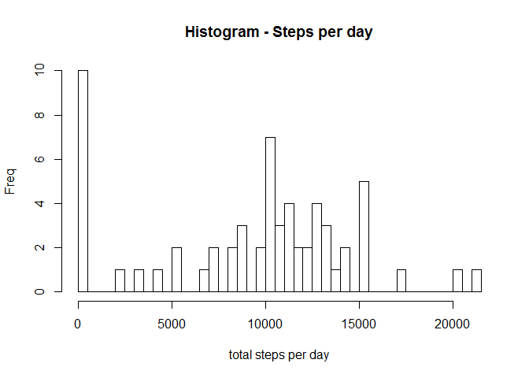
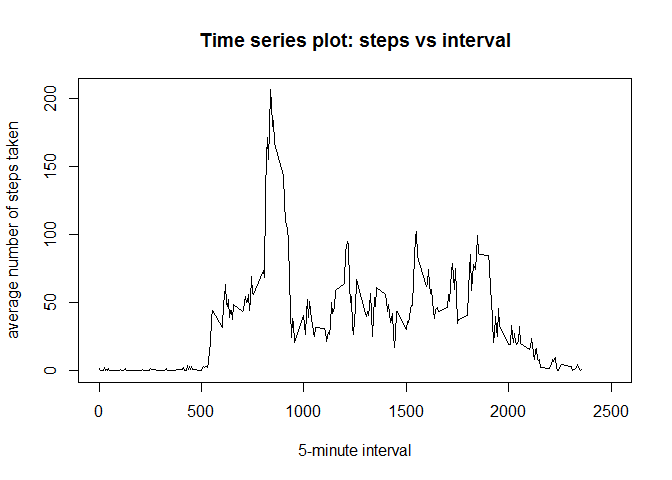
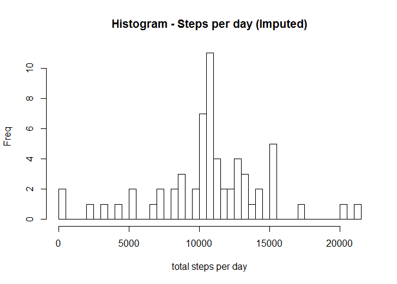
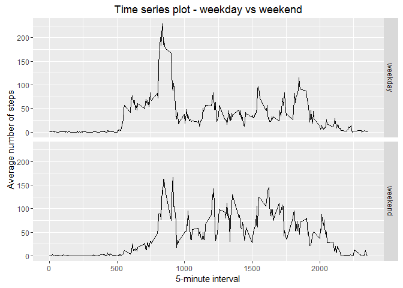

# Reproducible Research: Peer Assessment 1 - Greg L


```r
knitr::opts_chunk$set(comment = NA)
library(ggplot2)
```

***
## Loading and preprocessing the data
#### 1. Load the data (i.e. read.csv())

```r
if(!file.exists('activity.csv')){
    unzip('activity.zip')
}
in1 <- read.csv('activity.csv')
```
#### 2. Process/transform the data (if necessary) into a format suitable for your analysis

```r
# convert interval to military time by padding on the left with zeroes
in1$int5 <- sprintf("%04d",in1$interval)
```

***
## What is mean total number of steps taken per day?

#### 1. Make a histogram of the total number of steps taken each day

```r
StepsDay <- tapply(in1$steps, in1$date, sum, na.rm=TRUE)
hist(StepsDay, breaks=40, main="Histogram - Steps per day",
     ylab="Freq", xlab="total steps per day")
```

<!-- -->

#### 2. Calculate and report the mean and median total number of steps taken per day

```r
MeanStepsDay <- mean(StepsDay)
MedianStepsDay <- median(StepsDay)
```
* Mean steps per day: 9354.2295082
* Median steps per day: 10395

***
## What is the average daily activity pattern?

#### 1. Make a time series plot

```r
avgInt5Steps <- aggregate(x=list(steps=in1$steps), by=list(int5=in1$int5), FUN=mean, na.rm=TRUE)

plot(avgInt5Steps$int5, avgInt5Steps$steps, type="l", ann=FALSE, xlim=c(0,2500)) 
title(main="Time series plot: steps vs interval", 
      xlab="5-minute interval", ylab="average number of steps taken")
```

<!-- -->
  
#### 2. Which 5-minute interval, on average across all the days in the dataset, contains the maximum number of steps?

```r
mostSteps <- which.max(avgInt5Steps$steps)
timeMostSteps <- avgInt5Steps$int5[mostSteps]
```

* Most steps occurs at 5-minute interval: 0835

***
## Imputing missing values
#### 1. Calculate and report the total number of missing values in the dataset 

```r
TotNA <- length(which(is.na(in1$steps)))
```

* Total number of missing values: 2304
  
#### 2. Devise a strategy for filling in all of the missing values in the dataset.

```r
# Two possibilities for filling the missing values include:
# - replace missing values with zeroes
# - replace missing values with the AVERAGE for the 5-minute interval 
#
# I will do the latter, since the required averages were calculated earlier
```
  
#### 3. Create a new dataset that is equal to the original dataset but with the missing data filled in.

```r
new1 <- in1
for (j in 1:nrow(new1)) {
    if(is.na(new1$steps[j])) {
        ###cat("j=",j,"S=",new1$steps[j],"I=",new1$int5[j],"\n")
        new1$steps[j] <- round(avgInt5Steps$steps[avgInt5Steps$int5==new1$int5[j]])
    }    
}
```
  
#### 4. Make a histogram of the total number of steps taken each day 

```r
newStepsDay <- tapply(new1$steps, new1$date, sum)
hist(newStepsDay, breaks=40, main="Histogram - Steps per day (Imputed)",
     ylab="Freq", xlab="total steps per day")
```

<!-- -->
  
#### 4b. Calculate and report the mean and median total number of steps taken per day. 

```r
newMeanStepsDay <- mean(newStepsDay)
newMedianStepsDay <- median(newStepsDay)
```
* Mean steps per day (Imputed): 1.0765639\times 10^{4}
* Median steps per day (Imputed):  1.0762\times 10^{4}

* Mean steps per day (previous): 9354.2295082
* Median steps per day (previous): 10395

***
## Are there differences in activity patterns between weekdays and weekends?
  
#### 1. Create a new factor variable indicating if date is a weekday or weekend day.

```r
new1$dateType <- ifelse(as.POSIXlt(new1$date)$wday %in% c(0,6), 'weekend', 'weekday')
```
  
#### 2. Make a panel plot containing a time series plot (using Imputed data)

```r
avg_new1 <- aggregate(steps ~ interval + dateType, data=new1, mean)
p <- ggplot(avg_new1, aes(interval, steps)) + 
    geom_line() + 
    facet_grid(dateType ~ .) +
    xlab("5-minute interval") + 
    ylab("Average number of steps")
p + ggtitle("Time series plot - weekday vs weekend") 
```

<!-- -->

***
## THE END
